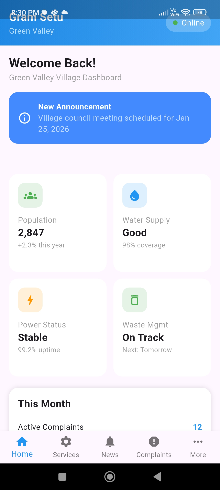
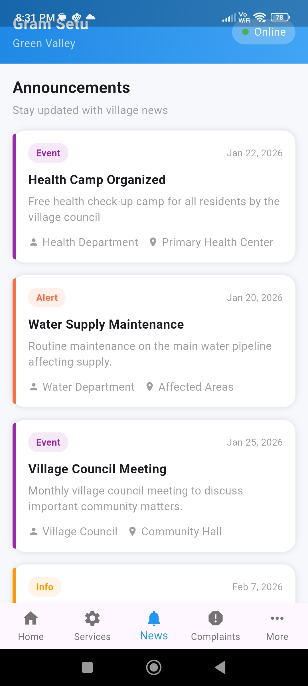
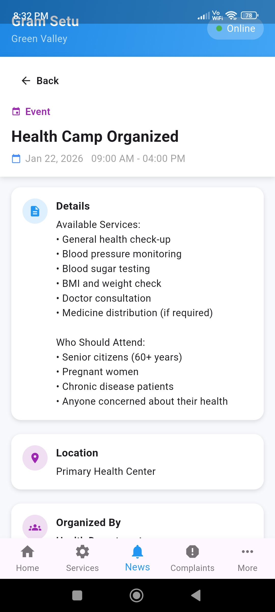
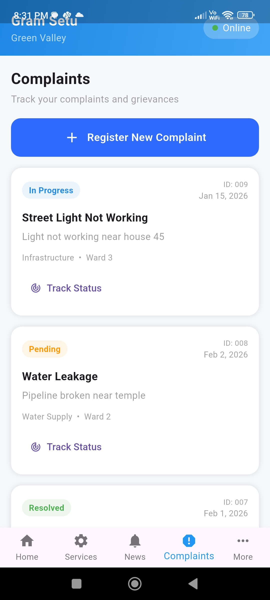
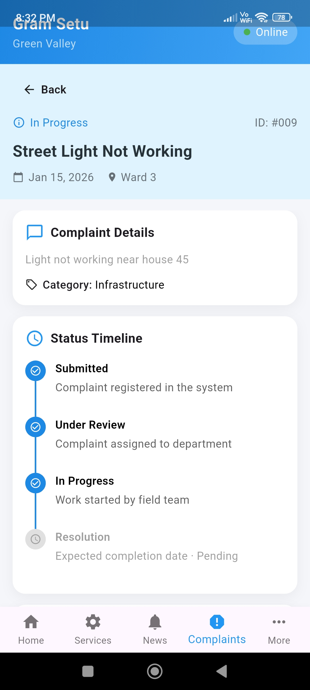
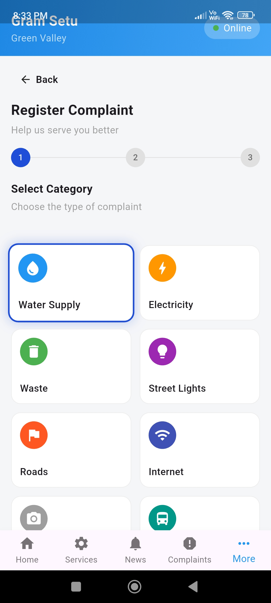

# 🏡 Smart Village Management App

<p align="center">
  <b>Digitizing rural services through a simple, accessible, and scalable mobile solution</b>
</p>

<p align="center">
  
  
  
  
</p>

---

## 📌 Overview

The **Smart Village Management App** is a Flutter-based mobile application designed to modernize village-level administration by enabling seamless communication between citizens and local authorities.

It simplifies everyday governance tasks such as complaint management, service requests, and administrative monitoring — all within a clean and user-friendly interface.

---

## 🚀 Key Features

### 👤 Role-Based Access

* Separate flows for **Citizens** and **Admins**
* Structured access control for better management

### 📢 Complaint & Service Management

* Submit complaints or service requests easily
* Organized request tracking system
* Real-time status updates

### 🛠 Admin Dashboard

* View all incoming requests
* Update and manage request status
* Monitor user activity

### 🔄 Transparent Tracking

* Users can track progress of requests
* Improves accountability and communication

### 🎯 User Experience

* Clean and minimal UI
* Smooth navigation across screens
* Designed for accessibility and ease of use

---

## 🧭 App Flow

```text
User → Register/Login → Dashboard → Submit Request → Track Status
                                 ↓
                            Admin Panel → Manage Requests → Update Status
```

---

## 📸 Screenshots

<p align="center">
</p>

| User Dashboard                 | Announcements                 | Announcement Details               |
|--------------------------------|-------------------------------|------------------------------------|
|            |  |         |
| Complaints                     | Complaint Details             | Register Complaint                 |
| ------------------------------ | ----------------------------  | --------------------------         |
|      |     |  |

---

## 🎥 Demo

<p align="center">
  
</p>

---

## 🛠 Tech Stack

| Technology | Purpose                               |
| ---------- | ------------------------------------- |
| Flutter    | Cross-platform mobile app development |
| Dart       | Programming language                  |

---

## 📂 Project Structure

```text
lib/
 ├── models/          # Data models
 ├── screens/         # UI screens
 ├── widgets/         # Reusable UI components
 ├── services/        # Business logic & helpers
 ├── main.dart        # Entry point
```

---

## 🧠 Architecture

The app follows a **modular architecture** focusing on separation of concerns:

* **UI Layer** → Screens and widgets
* **Logic Layer** → Handles app behavior and state
* **Model Layer** → Defines data structures

This ensures:

* Maintainability
* Scalability
* Clean code organization

---

## ⚙️ Getting Started

### Prerequisites

* Flutter SDK installed
* Android Studio / VS Code

### Installation

```bash
git clone <your-repo-link>
cd smart-village-app
flutter pub get
flutter run
```

## 📊 Highlights

* 📱 Fully functional mobile app
* 🧩 Modular and maintainable code structure
* 🔄 Real-world use case (rural digitization)
* 🎯 Focus on usability and simplicity

---

## ⚖️ Tradeoffs

### ✔ What was prioritized

* Core functionality over complex UI
* Simplicity and usability
* Clean structure within limited time

### 🔧 What can be improved

* Backend integration for real-time sync
* Authentication & security enhancements
* Push notifications for updates
* Advanced UI/UX with animations
* Cloud storage support

---

## 🌱 Future Enhancements

* 🌐 Integration with government APIs
* 📡 Offline-first support for low connectivity areas
* 🌍 Multi-language support
* 📊 Analytics dashboard for admin insights

---
